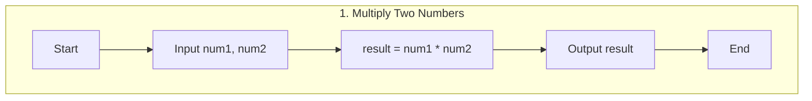
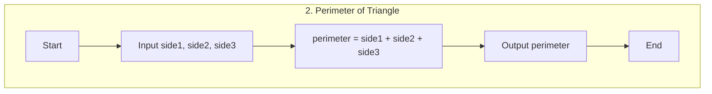
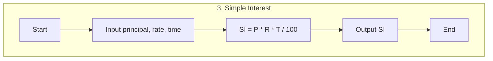
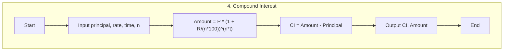
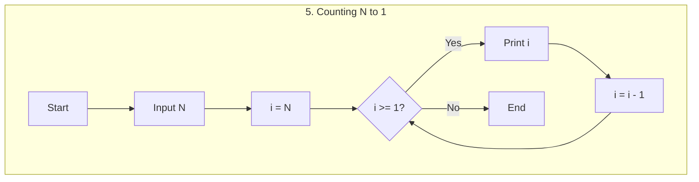
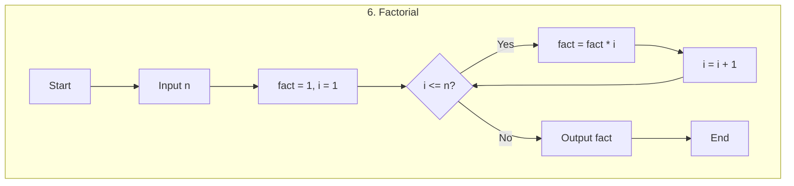
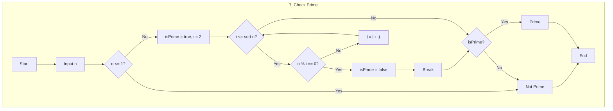
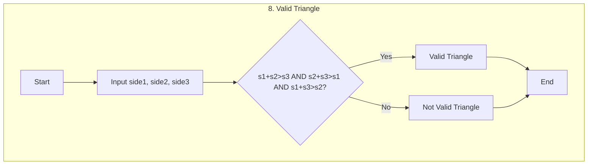
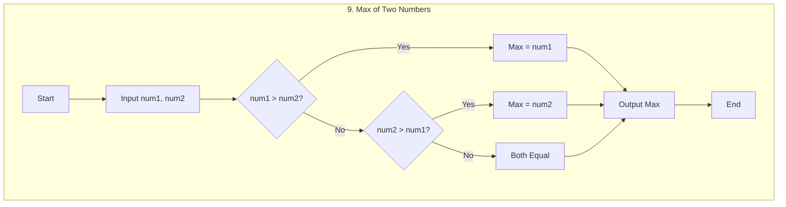

# DSA Codehelp RED SUPREME 4.0
## My DSA Notes

An organized, mobile-responsive site to learn Data Structures & Algorithms with clear explanations, flowcharts, code examples, videos, and PDFs. The left sidebar provides a structured Table of Contents; selecting any topic loads a detailed page on the right.

**Live Site**: https://abhijayshah.github.io/dsa/

**Repository**: https://github.com/Abhijayshah/dsa

## Highlights
- Dynamic right-side topic pages via `topics/template.html?topic=<slug>`
- Strong topic typing via `topics/topics-data.ts` (TypeScript)
- Safe, validated runtime data via `topics/topics-data.js`
- PDF preview section and placeholders for future resources
- Mermaid flowcharts and Prism syntax highlighting
- Basic dark/light theme toggle and responsive layout

## File Structure
- `/index.html` — Main page with sidebar TOC and right-side iframe content
- `/topics/` — Topic system
  - `template.html` — Reusable topic page (loads by URL param `topic`)
  - `topics-data.js` — Runtime topic data with slugs, titles, defaults
  - `topics-data.ts` — TypeScript interfaces and example for dev-time safety
- `/assets/`
  - `/images/` — Image assets placeholder
  - `/videos/` — Video assets placeholder
- `/assets/pdf/` — Consolidated PDF assets folder
  - `L1Basics_of_Programming_with_anno.pdf`
  - `L2Basics_of_Programming_with_anno.pdf`
  - `L3Basics_of_Programming_with_anno.pdf`
  - `DC-Basics of Programming .pdf`
  - `MS-Basics of Programming.pdf`
- Example C++ files and outputs:
  - `L1.cpp`, `L3.cpp`, `main.cpp`, `main1.cpp`, `11Nov.cpp`, `12Nov-NestedLoop.cpp`
  - `output/` builds and `*.dSYM` artifacts
- Misc:
  - `flowchart.html`, `L1-flowcharts_diagram.mermaid`
  - `.github/workflows/jekyll-docker.yml` (Pages workflow setup)

## How the Topic System Works
- Sidebar links in `index.html` point to `topics/template.html?topic=<slug>` and open in a right-side iframe (`name="topicFrame"`).
- `template.html` reads `topic` from the URL, validates it against `TOPICS` from `topics-data.js`, then renders:
  - Title, Category badge, description
  - YouTube embed (dummy link by default)
  - PDF link (dummy link by default)
  - Google Doc link (dummy link by default)
  - Notes list
- Error handling:
  - Missing or unknown slug shows a friendly error card
  - Non-HTTPS or missing links are disabled gracefully

## Add or Update Topics
- Edit `topics/topics-data.js` and add/update a topic object:
  - `slug` — unique ID used in URLs (e.g., `basics-l1`)
  - `title` — human-readable label (e.g., `L1-Basics of Programming`)
  - `category` — one of: `Introduction`, `Basics`, `Pattern Printing`, `Arrays`, `Searching & Sorting`, `Strings`, `Pointers`, `Recursion`, `Backtracking`, `Linked Lists`, `Stacks`, `Queues`, `Trees`, `Binary Search Trees`, `Heaps`, `Tries`, `Dynamic Programming`, `Graphs`, `Miscellaneous`
  - Optional: `description`, `youtubeUrl`, `pdfUrl`, `googleDocUrl`, `notes`
- Update the TOC in `index.html` to link the new slug:
  - Example: `topics/template.html?topic=basics-l1` with `target="topicFrame"`
- (Optional) Store assets under `assets/images/` and `assets/videos/`, and PDFs under a folder you prefer (e.g., `assets/pdfs/`) and update `pdfUrl` accordingly.

## Local Development
- Start a basic static server from project root:
  - `python3 -m http.server 8000`
  - Open `http://localhost:8000/index.html`
- Alternatively, use any static server (e.g., `npx serve`).

## Deployment (GitHub Pages)
- Branch: `main` (root folder)
- Auto-deploy: enabled via repository Settings → Pages
- Typical flow:
  - `git pull --rebase`
  - Make changes
  - `git add -A && git commit -m "Update topics/TOC/content"`
  - `git push -u origin main`
  - Wait 1–3 minutes, then verify `https://abhijayshah.github.io/DSA-Codehelp-RED-SUPREME_4.0/`

## Security & Performance
- External links use `rel="noopener"` to prevent tab hijacking
- No unsafe `innerHTML`; text rendered via `textContent`
- Validates URL parameters and resource URLs
- Responsive CSS grid ensures usability on mobile
- Lightweight dynamic template avoids duplicative static pages

## Contributing
- Keep topic slugs consistent between `index.html` and `topics/topics-data.js`
- Prefer adding new assets in `assets/` and link via relative paths
- For code examples, include concise samples (C++, Python, Java) with clear comments
- If adding heavy files, consider `.gitignore` entries to avoid committing build artifacts

## Planned Enhancements
- Search functionality for topics
- Progress tracking saved to localStorage
- Per-topic code examples with runnable snippets
- Dedicated `assets/pdfs/` folder and per-topic PDFs

## License
- Personal learning materials; please attribute when sharing.

This repository includes nine basic programming flowcharts. Below, each flowchart is rendered in its own Mermaid block so they appear stacked vertically in the README.

## 1. Multiply Two Numbers

## 2. Perimeter of Triangle

## 3. Simple Interest

## 4. Compound Interest

## 5. Counting N to 1

## 6. Factorial

## 7. Check Prime

## 8. Valid Triangle

## 9. Max of Two Numbers

View in Browser
- For an interactive web rendering, open `flowchart.html` in your browser.